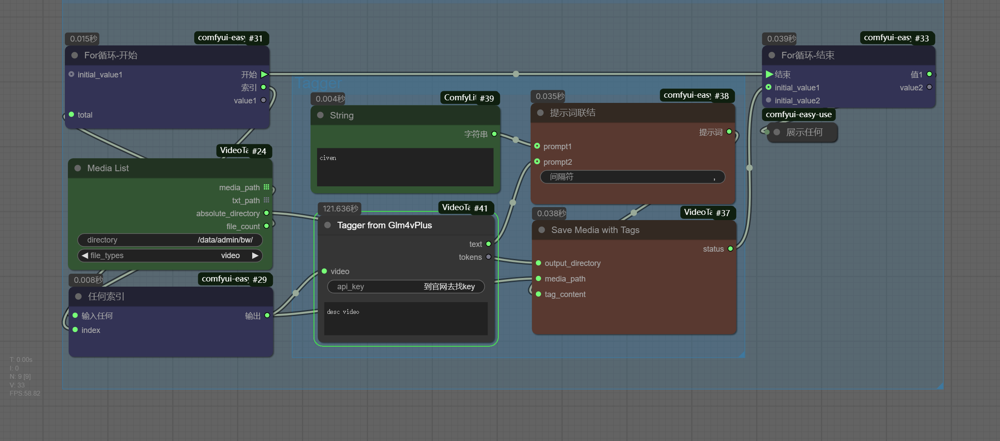

# ComfyUI-VideoTagger

<a href="./README.en.md">English</a>
<a href="./README.md">中文简体</a>

## 简介
ComfyUI-VideoTagger 是一个视频辅助打标工具，可以帮助用户轻松管理和标记视频与图片文件。通过简单的界面操作，实现对媒体文件的遍历，整理。

## 主要功能

### 视频/图片地址列表节点
- 通过输入目录路径，自动扫描并输出目录内的视频或图片文件列表
- 以文件名生成对应的文本文件列表
- 输出文件的绝对路径供后续处理

### 保存节点
- 通过输入的目录、媒体文件名和打标提示词内容
- 复制媒体文件到指定位置
- 同时生成并记录打标文本文件
- 方便后续管理与查找

### 智谱GLM视频分析
需要申请key：https://open.bigmodel.cn/usercenter/proj-mgmt/apikeys

## 安装方法
通过ComfyUI-Manager安装或通过以下步骤手动安装：
1. 将本项目克隆或下载到 ComfyUI 的 custom_nodes 目录下
   cd ComfyUI/custom_nodes/ComfyUI-VideoTagger
   pip install -r requirements.txt
2. 重启 ComfyUI
3. 在节点列表中找到 VideoTagger 相关节点即可使用

## 使用示例
- [VideoTagger 示例](./example_workflows/workflow.png)

## 特别鸣谢
- [@yolain](https://github.com/yolain/ComfyUI-Easy-Use) - 创建了 ComfyUI-Easy-Use 项目，为 ComfyUI 提供了多种优化和集成，使其更易于使用

## 贡献
欢迎提交问题报告和功能建议！

